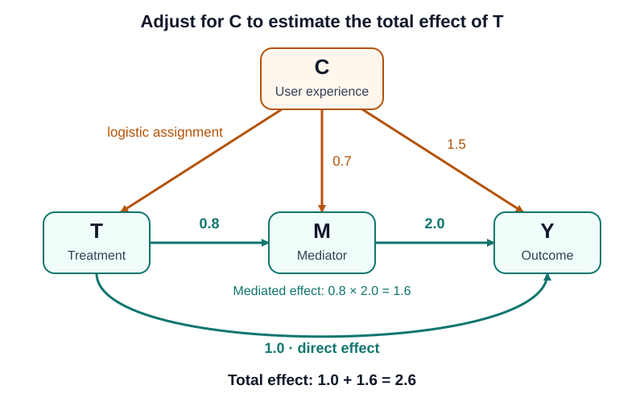

# Day 03 · DAGs and Backdoor Adjustment

## Today's question

**Which variables should we adjust for to estimate the total effect of treatment?**

[Day 02](../day-02/index.md) compared treated and untreated users within
power-user strata. Today, the confounder is continuous, and treatment also
affects the outcome through a mediator. A causal graph helps us choose the
adjustment variables before fitting a regression.

This note follows
[`adjust.py`](https://github.com/karim-moon/Causal/blob/main/src/day_03_dag_and_backdoor/adjust.py).
The script compares a regression of outcome on treatment alone with a regression
that also includes the measured confounder.

## Key concepts

### The causal DAG

A **directed acyclic graph (DAG)** represents assumed causal relationships.
An arrow points from a cause to its direct effect, and no directed path loops
back to its starting node.



*The graph matches the simulation's equations. Orange arrows originate at the
confounder; teal arrows show the direct and mediated treatment paths.
Numeric arrow labels are coefficients in the linear equations.
Treatment assignment uses a logistic probability rather than a linear coefficient.*

| Variable | Meaning | Role |
| --- | --- | --- |
| `C` | User experience, measured before treatment | Confounder affecting treatment, mediator, and outcome |
| `T` | Binary treatment assignment | Treatment whose total effect we want |
| `M` | A response to treatment and user experience | Mediator on the path from treatment to outcome |
| `Y` | Observed outcome | Outcome affected by treatment, mediator, and user experience |

The graph includes **all six direct relationships** in the code:
$C \to T$, $C \to M$, $C \to Y$, $T \to M$, $T \to Y$, and $M \to Y$.
Independent simulation noise terms are omitted from the drawing.

In this simulation, we know the graph because we wrote the generating equations.
In an observational study, the graph would express assumptions based on knowledge
of the system; fitting a regression alone would not establish those relationships.

### Backdoor paths and the adjustment set

A backdoor path between treatment and outcome starts with an arrow **into treatment**.
In this graph, the paths are:

| Path | Type | What to do when estimating the total effect |
| --- | --- | --- |
| $T \leftarrow C \to Y$ | Backdoor path through user experience | Block by adjusting for $C$ |
| $T \leftarrow C \to M \to Y$ | Backdoor path through user experience and mediator | Block by adjusting for $C$ |
| $T \to Y$ | Direct causal path | Preserve |
| $T \to M \to Y$ | Mediated causal path | Preserve |

The standard **backdoor criterion** requires an adjustment set that contains no
descendants of treatment and blocks every backdoor path.
Here, $\{C\}$ satisfies both conditions: $C$ precedes treatment and lies on both
backdoor paths. See [Pearl (2009), Section 3.3.1](https://ftp.cs.ucla.edu/pub/stat_ser/r350.pdf#page=19).

Adjusting for $C$ means comparing treatment groups at the same user-experience
level. We do not remove $C$ from the data or eliminate random noise.

### Total effect versus direct effect

The outcome equation contains a treatment coefficient of **1.0**, but that is
only the direct contribution. Treatment also changes $M$, which changes $Y$.

For this additive linear simulation:

$$
\begin{aligned}
\text{Direct effect} &= 1.0 \\
\text{Indirect effect through } M &= 0.8 \times 2.0 = 1.6 \\
\text{Total effect} &= 1.0 + 1.6 = 2.6
\end{aligned}
$$

Our target is the total average treatment effect:

$$
\operatorname{ATE} = \mathbb{E}[Y(1) - Y(0)] = 2.6
$$

Here, $Y(t)$ allows the mediator to respond to treatment $t$.
Including $M$ in the outcome regression would hold the mediator fixed in the
comparison and change the target. For this particular model, adjusting for both
$C$ and $M$ estimates the direct coefficient near 1.0. This is not the total ATE.

## Python experiment

### 1. Generate user experience and treatment

The script uses 20,000 users and a reproducible random generator:

```python
rng = np.random.default_rng(42)
N = 20_000

C = rng.normal(size=N)
p_treatment = 1 / (1 + np.exp(-1.2 * C))
T = rng.binomial(1, p_treatment, size=N)
```

The treatment probability is:

$$
P(T=1 \mid C=c) = \frac{1}{1+\exp(-1.2c)}
$$

Users with higher $C$ are more likely to receive treatment.
Assignment is random conditional on $C$, but the overall treatment groups have
different experience distributions. In this run, mean experience is approximately
**0.470 among treated users** and **−0.471 among untreated users**.

### 2. Generate the mediator and outcome

```python
M = 0.8 * T + 0.7 * C + rng.normal(size=N)
Y = 1.0 * T + 2.0 * M + 1.5 * C + rng.normal(size=N)
```

The two calls to `rng.normal` supply independent noise terms:

$$
\begin{aligned}
M &= 0.8T + 0.7C + \varepsilon_M \\
Y &= 1.0T + 2.0M + 1.5C + \varepsilon_Y
\end{aligned}
$$

Substituting the mediator equation into the outcome equation gives:

$$
\begin{aligned}
Y
&= 1.0T + 2.0(0.8T + 0.7C + \varepsilon_M)
   + 1.5C + \varepsilon_Y \\
&= 2.6T + 2.9C + 2\varepsilon_M + \varepsilon_Y
\end{aligned}
$$

This explains both the total treatment effect of 2.6 and the confounding:
experience contributes 2.9 outcome points per unit, and experience differs
between the treatment groups.

For the same user, holding $C$ and the noise terms fixed while switching treatment
changes the mediator by 0.8 and the outcome by 2.6. Every user's total effect
therefore equals 2.6 in this simulation.

### 3. Fit the unadjusted regression

```python
model = LinearRegression()
model.fit(T.reshape(-1, 1), Y)
print(model.coef_[0])
```

With binary treatment and an intercept, the treatment coefficient equals the
observed difference between treated and untreated outcome means.
`reshape(-1, 1)` gives scikit-learn a two-dimensional matrix with one feature.

The comparison combines the treatment effect with the experience difference:

$$
\begin{aligned}
\overline{Y}_{T=1}-\overline{Y}_{T=0}
= {}& 2.6 + 2.9(\overline{C}_{T=1}-\overline{C}_{T=0}) \\
&+ 2(\overline{\varepsilon_M}_{T=1}-\overline{\varepsilon_M}_{T=0}) \\
&+ (\overline{\varepsilon_Y}_{T=1}-\overline{\varepsilon_Y}_{T=0})
\end{aligned}
$$

The experience contribution alone is approximately
$2.9 \times (0.470 - (-0.471)) \approx 2.73$.
That systematic difference makes the unadjusted estimate much larger than 2.6.

### 4. Adjust for the confounder

```python
X = np.column_stack([T, C])
model.fit(X, Y)
print(model.coef_[0])
```

The feature matrix has treatment in column 0 and user experience in column 1.
Thus, `model.coef_[0]` is the adjusted treatment coefficient.
`LinearRegression` fits an intercept by default.
The second `fit` replaces the first fitted model; the first coefficient was
already printed, so both results remain visible in the script output.

This regression is correctly specified for the simulation because:

$$
\mathbb{E}[Y \mid T,C] = 2.6T + 2.9C
$$

The treatment coefficient captures both causal paths while controlling for $C$.
There is no need to include $M$ to capture its contribution to the total effect.

### 5. Run the script

From the repository root:

```bash
uv run src/day_03_dag_and_backdoor/adjust.py
```

With seed 42 and `N = 20_000`, the two printed values are:

```text
5.365044569189391
2.6231834233828164
```

The first is the unadjusted treatment coefficient; the second adjusts for $C$.

## Interpreting the results

| Quantity | Value | Interpretation |
| --- | ---: | --- |
| Known direct effect | 1.000 | Outcome change through $T \to Y$ |
| Known indirect effect | 1.600 | Outcome change through $T \to M \to Y$ |
| Known total ATE | 2.600 | Sum of the direct and indirect effects |
| Unadjusted coefficient | 5.365 | Confounded treatment-group comparison |
| Coefficient adjusted for $C$ | 2.623 | Estimate of the total ATE |

The adjusted coefficient is close to 2.6. Its remaining deviation reflects
finite-sample variation. The unadjusted comparison overestimates the effect
because the treated group has more experienced users.

### Connection to Day 02

Day 02 adjusted for a binary confounder by calculating effects within strata
and weighting them by the population's stratum proportions.
For this continuous confounder, the analogous backdoor adjustment formula is:

$$
\operatorname{ATE}
=
\int
\left[
\mathbb{E}[Y \mid T=1,C=c]
-
\mathbb{E}[Y \mid T=0,C=c]
\right] p_C(c)\,dc
$$

Here, the conditional mean difference is the constant 2.6, so averaging over
the distribution of $C$ still gives 2.6.
A single regression coefficient represents the ATE because the generating
model is additive and the treatment effect is constant.

### Assumptions behind the interpretation

The simulation provides a measured pre-treatment confounder, independent noise,
well-defined treatment, and no effects between users. Its logistic assignment
gives both treatment states positive probability at every finite value of $C$.
At extreme experience levels, probabilities can still be close to 0 or 1,
making finite-sample overlap sparse.

The DAG justifies **which variables** to adjust for. The generating equations
justify **how this linear regression** estimates the effect.
With nonlinear outcome relationships or treatment effects that depend on $C$,
a single additive treatment coefficient need not equal the ATE.
A suitable outcome model can instead predict each user's outcome under both
treatment states and average the predicted differences.

## Check your understanding

- Why is $C$ a confounder, while $M$ is a mediator?
- Which two backdoor paths does adjusting for $C$ block?
- Why is the total effect 2.6 even though the outcome equation has a treatment coefficient of 1.0?
- Why does leaving $M$ out of the adjusted regression preserve the mediated effect?
- Why does random treatment assignment conditional on $C$ still produce an unadjusted coefficient near 5.37?

## Open questions

- What changes if the treatment effect depends on user experience?
- What happens when $C$ is unmeasured or measured with error?
- How can we check overlap and quantify uncertainty in the adjusted estimate?
- How should we estimate a direct effect when mediator-outcome confounding is more complicated?

## References

- [Experiment code](https://github.com/karim-moon/Causal/blob/main/src/day_03_dag_and_backdoor/adjust.py).
- Pearl J (2009), [Causal inference in statistics: An overview](https://ftp.cs.ucla.edu/pub/stat_ser/r350.pdf),
  Section 3.3.1: backdoor adjustment; Section 5.1.1: controlled direct effects.
